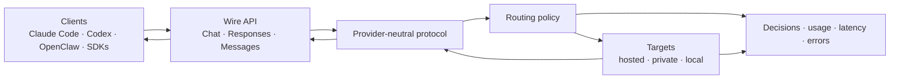

# Switchyard Technical Wiki

This page is a tree-shaped map of Switchyard: what it is made of, the ideas that
matter, where it can create leverage, and how to use its supported interfaces.
Expand a branch to move from the system view to concrete specifications and
examples.

The tree catalogs the supported surfaces. The linked
[TOML schema](reference/toml_schema.md), [CLI reference](cli_reference.md), and
[generated Rust API](reference/rust_api.md) remain the normative, field-level
references.

<div class="wiki-tree" markdown="1">

<details class="wiki-node" open markdown="1">
<summary><strong>Switchyard</strong> — a typed control plane for LLM traffic</summary>

Switchyard sits between LLM clients and model backends. It gives clients stable
OpenAI- and Anthropic-compatible interfaces while it selects a target, translates
the wire format, streams the result, and records what happened.



The shortest mental model is:

```text
client contract + normalized conversation + routing policy + target transport
```

Those four concerns are deliberately separate. A caller can keep its API, a
router can reason over common types, and a target can use a different provider
protocol.

<details class="wiki-node" markdown="1">
<summary><strong>1. Technology stack</strong> — runtimes, libraries, and responsibilities</summary>

### Runtime surfaces

| Surface | Main technology | What it owns | Use it when |
|---|---|---|---|
| `switchyard launch` | Python 3.12+ CLI + packaged PyO3 Rust server | Starts Claude Code, Codex, or OpenClaw; manages the local server lifecycle | A coding agent should use a Switchyard route without manual proxy setup |
| `switchyard-server` | Rust, Tokio, Axum | Native TOML deployment, HTTP ingress, routing, translation, retries, metrics | You need a standalone production proxy |
| `switchyard-libsy` | Rust, async streams and traits | Provider-neutral algorithms; the host fulfills requested model calls | An existing Rust application already owns transport and credentials |
| Python library | Python async components + Rust-backed values | Fixed-shape compatibility chain, custom processors, FastAPI app factory | You need Python-native composition or a minimal YAML route bundle |
| `switchyard-translation` | Pure Rust + `serde_json` | Buffered and streaming format codecs | You need protocol conversion without provider SDK or HTTP coupling |

### Stack by concern

| Concern | Technology | Why it is present |
|---|---|---|
| Core orchestration | Rust, Tokio, `futures` | Predictable async execution, typed algorithms, and low-overhead streams |
| Python integration | Python 3.12+, PyO3, Maturin | Python packaging and extension bindings over the Rust-owned core |
| Native HTTP server | Axum + Hyper | Concurrent OpenAI/Anthropic-compatible ingress and SSE relay |
| Python HTTP server | FastAPI + Uvicorn + `sse-starlette` | Composable Python app factory and endpoint extensions |
| Provider clients | Native HTTP in Rust; OpenAI, Anthropic, and `httpx` in Python | Calls OpenAI-compatible and Anthropic-compatible upstreams |
| Data contracts | `serde`, `serde_json`, Pydantic/provider SDK types at Python edges | Typed internal contracts with JSON-compatible boundaries |
| Configuration | TOML for native deployments; minimal YAML for `switchyard serve` | Explicit, reviewable topology separated from secrets |
| Observability | OpenTelemetry, Prometheus text, structured logs, JSONL routing logs | Per-route decisions, usage, latency, error, and session attribution |
| Quality | Cargo tests, pytest, pytest-asyncio, respx, Ruff, strict mypy, strict MkDocs | Cross-language correctness and published-doc validation |
| Packaging | Cargo/crates.io, Maturin wheels, `nemo-switchyard`, `uv` | Standalone Rust and Python-distributed execution paths |

### Responsibility boundaries

| Layer | Knows about routing? | Knows about providers? | Makes network calls? |
|---|:---:|:---:|:---:|
| `switchyard-protocol` | Carries decisions | Only wire-format identity and preserved fields | No |
| `switchyard-translation` | No | Yes, as codecs | No |
| `switchyard-libsy` | Yes | No; it works on normalized envelopes | No |
| `switchyard-llm-client` / server clients | Receives a selected target | Yes | Yes |
| `switchyard-server` | Composes the whole path | Yes, through configured clients | Yes |

The native server path is the feature-complete deployment surface. The Python
`switchyard serve --routes` path intentionally accepts only the minimal YAML
`noop` and `passthrough` bundle; native routing deployments use TOML.

</details>

<details class="wiki-node" markdown="1">
<summary><strong>2. Most important concepts</strong> — the mechanics behind the system</summary>

### 2.1 LLM clients, targets, and routes

A native deployment has three named layers:

```text
LLM client (transport + credential + format)
└── target (one upstream model ID)
    └── route (one client-visible model ID + one algorithm)
```

The names in the TOML tables are local references. A target's `id` is sent to
the upstream provider; a route's `id` is sent by the client to Switchyard. This
small distinction prevents transport configuration, provider model identity,
and public product identity from collapsing into one string.

### 2.2 Normalize, decide, translate

Inbound JSON is decoded into provider-neutral `switchyard-protocol` values.
Algorithms inspect that representation and publish a `Decision`; they do not
need OpenAI or Anthropic SDK objects. The selected target then receives an
encoded request in its configured format. Responses and stream events take the
reverse path.

Supported wire formats are:

| Format ID | Client/server endpoint | Upstream endpoint |
|---|---|---|
| `openai_chat` | `/v1/chat/completions` | `/v1/chat/completions` |
| `openai_responses` | `/v1/responses` | `/v1/responses` |
| `anthropic_messages` | `/v1/messages` | `/v1/messages` |

The normalized model includes instructions, messages, text and media content,
tool definitions/calls/results, sampling, output limits, reasoning controls,
usage, stop reasons, metadata, and provider extensions. Preservation metadata
keeps exact same-format payloads available when a lossless replay is possible.

### 2.3 Algorithms are policies, not transports

| Algorithm | Decision rule | Extra model calls |
|---|---|---|
| `passthrough` | Always use one target | None |
| `random` | Uniform or weighted target selection | None |
| `llm_classifier`, capability mode | Judge the request, then select efficient or capable | One judge call unless affinity reuses a decision |
| `llm_classifier`, escalation mode | Serve efficient first; judge the completed trajectory and latch capable when needed | One answer call plus judge calls until latched |
| `llm_classifier`, custom mode | Validate a custom judge schema, then resolve a target label | One judge call unless affinity reuses a decision |
| `stage_router` | Score tool-result and progress signals; optionally ask a judge on ambiguous turns | None on decisive signals; optional judge on ties |
| `noop` | Return `OK` locally | None; intended for smoke tests |

“Capable,” “efficient,” “strong,” and “weak” are roles inside an algorithm, not
properties permanently attached to a model.

### 2.4 Fixed Python chain shape

The Python compatibility chain is constructed as:

```text
request processor* → exactly one LLMBackend → response processor* → TranslationEngine
```

Request processors transform `ChatRequest`; response processors transform
`ChatResponse`; the backend performs the model call; the translator returns the
client's wire contract. `ProxyContext` carries per-request facts such as the
selected target, backend latency, evicted targets, and component metadata.

### 2.5 Host-owned calls in libsy

`switchyard-libsy` does not own HTTP. An `Algorithm` emits a stream of `Step`
values. A `Step::CallModel` gives the host a normalized request and decision; the
host responds with the model result. `Step::ReturnToAgent` ends the run. This
inversion lets an existing gateway keep its connection pools, retries, auth,
quotas, and audit controls.

### 2.6 Streaming is a first-class contract

Streaming is not implemented as “buffer, then fake SSE.” The protocol carries a
single-consumption response stream; codecs translate events incrementally and
finish provider-specific terminal events. Python `ChatResponseStream` supports
`tap`, `map`, `on_complete`, and `aclose`, so observation and cleanup stay part
of the stream lifecycle.

### 2.7 Session identity and affinity

Canonical `x-switchyard-*` metadata normalizes session, agent, parent-agent,
task, turn, request, and subagent signals from supported harnesses. Classifier
routes can reuse the first target decision for a session. A first-message hash
is available as a weaker fallback when clients cannot provide a session ID.

Affinity is process-local. It improves conversation consistency and avoids
repeated judge calls, but it is not a distributed sticky-session store.

### 2.8 Context-window eviction

When an upstream reports a context-window 4xx, routing can mark that target as
evicted and retry another eligible target. If every candidate overflows, the
caller receives a typed pool-exhausted failure rather than an unbounded retry.
See [Context-Window Handling](operations/context_window.md).

### 2.9 Observability belongs to the decision path

The server records the selected model, rationale, answer/judge usage, model-call
latency, routing overhead, cache tokens, reasoning tokens, fail-open events, and
upstream attempts. `/v1/stats` gives an operational snapshot; `/metrics` exposes
Prometheus data; optional JSONL routing logs support exact session aggregation.

</details>

<details class="wiki-node" markdown="1">
<summary><strong>3. Idea diamonds</strong> — the concepts worth exposing in a product or architecture story</summary>

These are the high-leverage ideas behind the implementation.

| Diamond | Exposed as | Why it matters |
|---|---|---|
| **Stable client contract, movable backend** | Three compatible ingress APIs plus cross-format translation | Applications do not need a provider migration each time routing policy or model supply changes |
| **Provider-neutral intermediate representation** | `switchyard-protocol` | Routing, logging, and policy can be written once, like compiler passes over an IR |
| **Policy/transport separation** | libsy asks the host to fulfill `CallModel` steps | A gateway can adopt routing without surrendering auth, retries, sockets, or compliance boundaries |
| **Public route ID is a product; target ID is infrastructure** | `routes.<name>.id` versus `targets.<name>.id` | Teams can offer a stable “smart” model while changing the models behind it |
| **Routing evidence is explicit** | `Decision`, selected-model/rationale headers, JSONL log | Cost/quality optimization becomes inspectable rather than hidden proxy magic |
| **Capability is contextual** | Target roles live inside each route | The same model can be efficient in one portfolio and capable in another |
| **Agent stage is a routing signal** | Stage-router scores errors, exploration, production, and tests | Multi-model systems can spend capability on uncertainty and recovery, not uniformly on every turn |
| **Lossless when possible, explicit when lossy** | Preservation metadata, provider extensions, translation policy | Translation can retain provider details without polluting the normalized core |
| **Failure can change the candidate set** | Context-window eviction and bounded retry | A retry is a routing decision, not a blind repetition against the same impossible target |
| **Streams are values with lifecycle** | Incremental codecs and close/completion callbacks | Cancellation, usage accounting, and resource cleanup stay correct under SSE |

A useful product sentence is: **Switchyard turns a model name into a governed,
observable routing policy while preserving the client's native API.**

</details>

<details class="wiki-node" markdown="1">
<summary><strong>4. Use cases and examples</strong> — where Switchyard can make a difference</summary>

Every example below corresponds to a different operational advantage. Replace
the illustrative model IDs and URLs with models available from your provider.

<details class="wiki-node" markdown="1">
<summary><strong>Use case 1 — run coding agents through one governed model route</strong></summary>

**Difference:** developers keep using Claude Code, Codex, or OpenClaw while the
platform team owns model selection and observability behind the route ID.

```bash
uv tool install --python 3.12 "nemo-switchyard[cli,server]"
export OPENROUTER_API_KEY="your-openrouter-key"  # pragma: allowlist secret

switchyard launch codex --model switchyard
# The same packaged deployment also supports:
# switchyard launch claude --model switchyard
# switchyard launch openclaw --model switchyard
```

For a custom deployment:

```bash
switchyard launch codex --model engineering --config routes.toml
```

The launcher starts the packaged native server, points the agent at it, forwards
arguments after `--`, and stops the server when the agent exits. See the
[launcher CLI](cli_reference.md#launcher-path-switchyard-launch).

</details>

<details class="wiki-node" markdown="1">
<summary><strong>Use case 2 — bridge an Anthropic client to an OpenAI-format backend</strong></summary>

**Difference:** the client and upstream can evolve independently. This is useful
for provider migration, private inference, or one API surface across a mixed
model fleet.

```toml
schema_version = 1

[llm_clients.private_openai]
format = "openai_chat"
base_url = "https://llm.example.com/v1"
api_key_env = "PRIVATE_LLM_KEY"

[targets.assistant]
id = "company/assistant-v3"
llm_client = "private_openai"

[routes.compatible]
id = "company-assistant"
type = "passthrough"
target = "assistant"
```

Start the server, then send Anthropic Messages JSON to the route even though the
target speaks OpenAI Chat Completions:

```bash
export PRIVATE_LLM_KEY="your-private-key"  # pragma: allowlist secret
switchyard-server --config routes.toml --host 127.0.0.1 --port 4000

curl http://localhost:4000/v1/messages \
  -H "Content-Type: application/json" \
  -d '{
    "model": "company-assistant",
    "max_tokens": 128,
    "messages": [{"role": "user", "content": "Explain tail latency."}]
  }'
```

The returned body uses the Anthropic Messages contract. Requests, aggregate
responses, tools, and streaming events all pass through the translation layer.

</details>

<details class="wiki-node" markdown="1">
<summary><strong>Use case 3 — spend capable-model budget only on hard work</strong></summary>

**Difference:** a capability judge forecasts whether an efficient model can
solve the whole task. The deterministic threshold policy then chooses the tier.

```toml
schema_version = 1

[llm_clients.openrouter]
format = "openai_chat"
base_url = "https://openrouter.ai/api/v1"
api_key_env = "OPENROUTER_API_KEY"

[targets.judge]
id = "openai/gpt-4o-mini"
llm_client = "openrouter"

[targets.capable]
id = "openai/gpt-4o"
llm_client = "openrouter"

[targets.efficient]
id = "openai/gpt-4o-mini"
llm_client = "openrouter"

[routes.smart]
id = "smart"
type = "llm_classifier"
mode = "capability"
classifier_target = "judge"
strong_target = "capable"
weak_target = "efficient"
base_threshold = 0.5
threshold_step = 0.1
session_affinity = true
```

```bash
curl http://localhost:4000/v1/chat/completions \
  -H "Content-Type: application/json" \
  -H "x-switchyard-session-id: demo-session" \
  -d '{"model":"smart","messages":[{"role":"user","content":"Design a lock-free queue."}]}' \
  -i
```

Inspect `x-model-router-selected-model` and `x-model-router-rationale` in the
response. Treat the selection as model output, not a fixed test assertion. See
[LLM Classifier Routing](routing_algorithms/llm_classifier_routing.md).

</details>

<details class="wiki-node" markdown="1">
<summary><strong>Use case 4 — run a reproducible A/B or canary split</strong></summary>

**Difference:** callers use one route while traffic is split by a reviewed
server policy. Relative weights need not sum to one; a seed reproduces the same
selection sequence for the same call order.

```toml
[routes.experiment]
id = "assistant-experiment"
type = "random"
targets = ["control", "candidate"]
weights = [9, 1]
seed = 42
```

```bash
for request_number in 1 2 3 4 5; do
  curl -sS -D - http://localhost:4000/v1/chat/completions \
    -H "Content-Type: application/json" \
    -d "{\"model\":\"assistant-experiment\",\"messages\":[{\"role\":\"user\",\"content\":\"request ${request_number}\"}]}" \
    -o /dev/null | grep -i '^x-model-router-selected-model:'
done
```

Compare model-level requests, errors, tokens, and latency through `/v1/stats` or
`/metrics`. See [Random Routing](routing_algorithms/random_routing.md).

</details>

<details class="wiki-node" markdown="1">
<summary><strong>Use case 5 — route coding-agent turns by stage</strong></summary>

**Difference:** early exploration, error recovery, and hard reasoning can use a
capable model; settled edits and test loops can use an efficient one. Decisive
tool signals avoid a judge call.

```toml
[routes.engineering]
id = "engineering"
type = "stage_router"
capable_target = "capable"
efficient_target = "efficient"
picker = "efficient_first"
confidence_threshold = 0.5
recent_turn_window = 3

[routes.engineering.handoff_notes]
escalation_note = "The previous model was stalling; continue the diagnosis."
deescalation_note = "The plan is settled; continue the mechanical work."
```

Start with `0.5`, then calibrate against representative agent trajectories.
Pure chat workloads without tool-result history fall back to the picker's
default tier. See [Stage-Router Routing](routing_algorithms/stage_router_routing.md).

</details>

<details class="wiki-node" markdown="1">
<summary><strong>Use case 6 — turn a domain rubric into multi-target policy</strong></summary>

**Difference:** custom classifier mode can choose among more than two targets
using a strict JSON Schema and a deterministic JSON Pointer policy. For example,
a support platform can separate fast FAQs, multilingual work, reasoning-heavy
diagnosis, and premium escalation.

```toml
[routes.support]
id = "support"
type = "llm_classifier"
mode = "custom"
classifier_target = "judge"
targets = ["fast", "multilingual", "reasoning", "premium"]
default_target = "premium"
prompt = """
Choose the best configured target. Return JSON matching the supplied schema.
"""
response_schema = '''
{
  "type": "object",
  "properties": {
    "target": {
      "type": "string",
      "enum": ["fast", "multilingual", "reasoning", "premium"]
    }
  },
  "required": ["target"],
  "additionalProperties": false
}
'''

[routes.support.policy]
type = "target_selector"
selector = "/target"
```

An invalid verdict, unavailable judge, missing pointer, or unknown target uses
`default_target`. The judge schema is sent through provider structured-output
configuration and validated again by Switchyard.

</details>

<details class="wiki-node" markdown="1">
<summary><strong>Use case 7 — embed routing in Python without giving libsy the network</strong></summary>

**Difference:** application-owned clients keep transport, test doubles, and
credentials while Rust-owned algorithms make decisions.

```python
import asyncio
from collections.abc import Mapping

from switchyard.libsy import LlmTarget, algorithms


class EchoClient:
    def __init__(self, model: str) -> None:
        self.model = model

    async def call(
        self, request: Mapping[str, object]
    ) -> Mapping[str, object]:
        return {
            "model": self.model,
            "outputs": [{
                "role": "assistant",
                "content": [{"type": "text", "text": self.model}],
            }],
        }


async def main() -> None:
    request = {
        "model": "auto",
        "messages": [{
            "role": "user",
            "content": [{"type": "text", "text": "Hello"}],
        }],
    }
    algorithm = algorithms.random(
        [
            LlmTarget("fast", EchoClient("fast")),
            LlmTarget("quality", EchoClient("quality")),
        ],
        weights=[1, 3],
        seed=42,
    )
    decisions, response = await algorithm.run(request)
    print(decisions, response)


asyncio.run(main())
```

The repository contains the complete runnable
[`examples/libsy.py`](../examples/libsy.py).

</details>

<details class="wiki-node" markdown="1">
<summary><strong>Use case 8 — operate a shared, observable model gateway</strong></summary>

**Difference:** many internal clients can discover the same route catalog while
operators see decision overhead, usage, cache behavior, failures, and exact
session totals.

```bash
switchyard-server --config routes.toml \
  --routing-log-file ./var/routing.jsonl \
  --host 0.0.0.0 --port 4000

curl http://localhost:4000/v1/models
curl http://localhost:4000/v1/stats
curl http://localhost:4000/metrics
curl 'http://localhost:4000/v1/routing/session-stats?session_id=demo-session'
```

The session endpoint exists only when `--routing-log-file` is enabled and
returns `404` for an unknown session. In production, put authentication and TLS
at the appropriate trust boundary; a liveness response alone is not an access
control mechanism.

</details>

</details>

<details class="wiki-node" markdown="1">
<summary><strong>5. Analogy transfers</strong> — how the idea maps to other stacks and spheres</summary>

### Transfer to another implementation stack

The architecture is not Rust-specific. Its seams transfer directly:

| Switchyard seam | Go analogue | Java/Kotlin analogue | TypeScript analogue |
|---|---|---|---|
| Provider-neutral protocol types | Structs + tagged interfaces | Records/sealed interfaces | Discriminated unions |
| Format codec registry | Interface implementations keyed by format | Strategy beans/service loader | Codec map with typed adapters |
| `Algorithm` step stream | Channel or iterator of commands | `Flow`/Reactive Streams | Async generator |
| Host-owned `CallModel` fulfillment | Callback over `context.Context` | Suspended function/client port | Promise-returning client interface |
| Route composition | Immutable config graph | Dependency-injection graph | Validated config factory |
| Native HTTP ingress | Chi/Gin/Fiber | Spring WebFlux/Ktor | Fastify/Hono |
| Metrics and traces | OpenTelemetry Go | Micrometer + OpenTelemetry | OpenTelemetry JS |

The invariant to preserve is more important than the framework: **normalize at
the edge, decide over common types, and keep transport behind a target client.**

### Transfer to other technical domains

| Sphere | Switchyard analogue | Transferable lesson |
|---|---|---|
| Compiler | Source languages → IR → optimization pass → target code | A neutral representation lets many inputs share one decision engine |
| Service mesh | Virtual service → traffic policy → cluster endpoint | A stable logical name can hide weighted, failover, or policy-selected destinations |
| Database optimizer | SQL → logical plan → cost model → physical plan | Selection quality depends on explicit evidence and measurable outcomes |
| Message broker | Topic → routing key → consumer group | Producers should not need endpoint identity or balancing logic |
| Feature flags | Stable feature key → targeting rule → variant | Random routing is useful only when assignment and outcomes are observable |
| Storage tiering | Hot/warm/cold policy → storage class | Expensive capability should be allocated according to workload signals |
| SRE incident response | Triage → escalation → specialist handoff | Stage routing is a machine analogue of escalating uncertainty and returning routine work after stabilization |
| Airline or rail hub | Passenger contract → routing hub → changing vehicle/line | The journey remains recognizable while the underlying leg is substituted |
| Human work allocation | Intake rubric → skill-based queue → worker | “Strong” and “weak” are contextual roles; assignment should match the task, not rank people globally |

### Limits of the analogies

LLM routing decisions can be probabilistic and model-generated. Unlike a packet
router, Switchyard may spend an extra inference call to decide where work goes,
and unlike a compiler, translation between provider APIs can be lossy. That is
why fallback policy, preservation, decision logs, and outcome measurement are
part of the core idea rather than optional polish.

</details>

<details class="wiki-node" markdown="1">
<summary><strong>6. Specifications and APIs</strong> — supported contracts and canonical references</summary>

<details class="wiki-node" markdown="1">
<summary><strong>6.1 HTTP API</strong></summary>

The native server exposes these routes:

| Method | Path | Request/response contract | Notes |
|---|---|---|---|
| `POST` | `/v1/chat/completions` | OpenAI Chat Completions | Buffered and streaming |
| `POST` | `/v1/responses` | OpenAI Responses | Buffered and streaming |
| `POST` | `/v1/messages` | Anthropic Messages | Buffered and streaming |
| `POST` | `/v1/messages/count_tokens` | Anthropic token-count request | Chooses an Anthropic-format target reachable by the route |
| `GET` | `/v1/models` | OpenAI-compatible model list plus Codex model metadata | Lists route IDs, not every upstream provider model |
| `GET` | `/v1/stats` | Per-model and routing statistics | Process-local snapshot |
| `POST` | `/v1/stats/reset` | Empty reset request | Clears accumulated process stats |
| `GET` | `/v1/routing/session-stats?session_id=ID` | Exact-session call and token totals | Registered only with a routing log |
| `GET` | `/metrics` | Prometheus text | Process-wide OpenTelemetry instruments |
| `GET` | `/health` | Liveness | Returns while the process is serving |

All three generation endpoints read the route ID from the JSON `model` field.
They can address any configured route regardless of the target's format.

Successful routed responses can include:

| Header | Meaning |
|---|---|
| `x-model-router-selected-model` | Upstream model selected for the answer call |
| `x-model-router-rationale` | Human-readable routing reason, truncated to a safe header size |

Canonical request metadata uses `x-switchyard-session-id`,
`x-switchyard-agent-id`, `x-switchyard-parent-agent-id`,
`x-switchyard-is-subagent`, `x-switchyard-agent-kind`,
`x-switchyard-agent-role`, `x-switchyard-task-id`, `x-switchyard-task-kind`,
`x-switchyard-turn-id`, `x-switchyard-request-id`, and
`x-switchyard-session-final`. The protocol also normalizes supported
harness-native aliases. Send explicit Switchyard headers when you control the
caller and need deterministic precedence.

The Python FastAPI app factory registers the three generation endpoints,
`/v1/models`, and `/health`. Components may contribute stats, metrics, or other
operational endpoints. The native server table above is the complete standalone
server contract.

</details>

<details class="wiki-node" markdown="1">
<summary><strong>6.2 Native TOML deployment schema</strong></summary>

Top-level shape:

```toml
schema_version = 1

[llm_clients.<local-name>]
# transport

[targets.<local-name>]
# upstream model

[routes.<local-name>]
# public model and algorithm
```

| Table | Required fields | Optional fields |
|---|---|---|
| Root | `schema_version = 1`, `targets`, `routes` | `llm_clients` |
| `llm_clients.<name>` | `format`, `base_url` | `api_key_env`, `extra_headers`, `max_retries` (default `2`, range `0..10`) |
| `targets.<name>` | `id`, `llm_client` | `extra_body` |
| `routes.<name>` | `id`, `type` | `context_window`, `tool_calling`, `reasoning`, then type-specific keys |

Route-specific contracts:

| Type | Required | Important optional fields |
|---|---|---|
| `noop` | No target fields | Common route metadata only |
| `passthrough` | `target` | Common route metadata |
| `random` | `targets` | `weights`, `seed` |
| `llm_classifier` capability | `classifier_target`, `strong_target`, `weak_target`, `base_threshold` | `threshold_step`, affinity, recent window, prompt, judge token limit |
| `llm_classifier` escalation | `classifier_target`, `strong_target`, `weak_target` | prompt, confirmation count, trajectory window and character cap |
| `llm_classifier` custom | `classifier_target`, `targets`, `default_target`, `prompt`, `response_schema`, `policy` | affinity, recent window, judge token limit |
| `stage_router` | `capable_target`, `efficient_target`, `picker`, `confidence_threshold` | recent window, tier prompts, handoff notes, classifier fallback |

`api_key_env` contains an environment-variable name, never the key. Target
`extra_body` is shallow-merged only where the inbound request has not already
set the key. `format` is explicit; the server does not probe an upstream to
guess its API.

Use the [complete TOML schema](reference/toml_schema.md) for every field,
default, range, cross-field constraint, and validation behavior. Validate before
binding a socket:

```bash
switchyard-server --config routes.toml --dry-run
```

</details>

<details class="wiki-node" markdown="1">
<summary><strong>6.3 CLI API</strong></summary>

```text
switchyard launch <claude|codex|openclaw> --model ID [--config PATH] [-- AGENT_ARGS]
switchyard serve --routes PATH [transport and logging options]
switchyard-server --config PATH [server options]
```

`switchyard launch` consumes native TOML and hosts the packaged native server.
`switchyard serve` consumes the minimal Python YAML bundle. `switchyard-server`
is the standalone Rust binary and supports dry-run validation, host/port,
backlog, graceful-shutdown timeout, TLS certificate/key, and routing-log output.
See the [complete CLI reference](cli_reference.md).

</details>

<details class="wiki-node" markdown="1">
<summary><strong>6.4 Public Python API</strong></summary>

Install the core library with `pip install nemo-switchyard`; add `[server]`,
`[cli]`, or `[all]` for optional surfaces. Imports use `switchyard`, not the
distribution name.

#### Requests, responses, and streams

| API | Contract |
|---|---|
| `ChatRequest.openai_chat(body)` | Owned OpenAI Chat request |
| `ChatRequest.openai_responses(body)` | Owned OpenAI Responses request |
| `ChatRequest.anthropic(body)` | Owned Anthropic Messages request |
| `ChatRequest.body`, `.model`, `.validate()`, `.set_model()`, `.replace_body()` | Read or mutate the owned request |
| `ChatResponse.openai_completion(body)` / `.openai_stream(stream)` | OpenAI Chat response forms |
| `ChatResponse.openai_responses_completion(body)` / `.openai_responses_stream(stream)` | OpenAI Responses forms |
| `ChatResponse.anthropic_completion(body)` / `.anthropic_stream(stream)` | Anthropic forms |
| `ChatResponse.body`, `.stream`, `.replace_body()` | Buffered/stream access |
| `AnyResponseStream.tap(callback)` | Observe each event |
| `AnyResponseStream.map(callback)` | Transform each event |
| `AnyResponseStream.on_complete(callback)` | Run after normal exhaustion |
| `await AnyResponseStream.aclose()` | Close the upstream source |

`ChatRequestType` identifies the three request formats.
`ChatResponseType` distinguishes format and buffered/streaming delivery.
`OpenAIChatRequest`, `ResponsesChatRequest`, `AnthropicChatRequest`, and the
format-specific response names exported at package root are compatibility
aliases over these Rust-backed values. `AnyResponseStream` is the public alias
for the underlying `ChatResponseStream` value.

#### Chain and backend roles

```python
Switchyard(
    *,
    request_processors=None,
    backend: LLMBackend,
    response_processors=None,
    translator,
    fallback_target_on_evict=None,
)

await switchyard.call(request, ctx=None)
```

A custom `LLMBackend` implements:

```python
@property
def supported_request_types(self) -> list[ChatRequestType]: ...

async def call(
    self, ctx: ProxyContext, request: ChatRequest
) -> ChatResponse: ...
```

Public backend/configuration APIs are:

| API | Purpose |
|---|---|
| `LlmTarget(...)` | Target ID, provider model, format, endpoint, body/header additions |
| `BackendFormat` | `AUTO`, `OPENAI`, `RESPONSES`, `ANTHROPIC` |
| `OpenAiNativeBackend(target)` | OpenAI Chat or Responses target backend |
| `AnthropicNativeBackend(target)` | Anthropic Messages target backend |
| `RandomRoutingProcessorConfig(strong, weak, strong_probability=0.5, rng_seed=None)` | Configuration value used by the random-routing compatibility surface |
| `ProxyContext(metadata=None, request_id=None)` | Per-request shared state |
| `RequestMetadata.from_headers(headers)` | Session/task metadata extraction |
| `TranslationEngine()` | Request, response, and incremental stream translation |

The translation engine's main methods are `translate_request`,
`translate_response`, `request_to`, `request_to_any_of`, `response_to`,
`response_for_request`, `stream_for_request`, and `translate_stream`.

#### Dispatch and HTTP hosting

| API | Purpose |
|---|---|
| `RouteTable()` | Exact-match mapping from public model IDs to chains |
| `register(model, switchyard, metadata=None, default=False)` | Add or replace a model route |
| `lookup_switchyard(model)` | Resolve a chain; raises `KeyError` when absent |
| `registered_models()` / `registered_model_entries()` | Discovery views |
| `set_default_model(model)` / `default_model()` | Model-list default |
| `build_switchyard_app(runtime)` | Build the FastAPI app; requires the `server` extra |
| `OpenAIChatEndpoint`, `ResponsesEndpoint`, `AnthropicMessagesEndpoint`, `ModelsEndpoint` | Optional endpoint components |

`RlLoggingRequestProcessor` and `RlLoggingResponseProcessor(log_dir)` are the
public paired processors for local training-trace capture. They observe the
request/response pair without changing the proxied response.

</details>

<details class="wiki-node" markdown="1">
<summary><strong>6.5 Python libsy API</strong></summary>

`switchyard.libsy` runs Rust-owned algorithms with Python-hosted clients:

| API | Signature or role |
|---|---|
| `LlmClient` | Protocol with `async call(request: Mapping) -> Mapping` |
| `LlmTarget(name, client)` | Name plus host-owned model client |
| `algorithms.noop()` | Local no-op algorithm |
| `algorithms.random(targets, weights=None, seed=None)` | Weighted target selection |
| `algorithms.llm_task_classifier(judge, efficient, capable, config=...)` | Capability classifier |
| `algorithms.stage_router(capable, efficient, ...)` | Signal-driven tier routing |
| `TaskClassifierConfig(...)` | Threshold, affinity, window, token budget, and prompt |
| `LlmFallback(judge_target, config=...)` | Optional stage-router judge fallback |
| `await Algorithm.run(request, headers=None)` | Returns decision records and aggregate normalized response |

The accepted request and returned response mappings are the serialized
`switchyard-protocol` shapes, not OpenAI or Anthropic wire JSON.

</details>

<details class="wiki-node" markdown="1">
<summary><strong>6.6 Rust crate APIs</strong></summary>

| Crate | Principal public API |
|---|---|
| `switchyard-protocol` | `Request`, `Response`, `LlmRequest`, `Message`, `ContentBlock`, tools, usage, streams, `Metadata`, `Decision`, `RoutedLlmClient`, `WireFormat` |
| `switchyard-libsy` | `Algorithm`, `Step`, `CallModel`, `Driver`, `LlmTarget`, classifiers/processors/state, `Passthrough`, `Random`, `LlmTaskClassifier`, `StageRouter` |
| `switchyard-translation` | `TranslationEngine`, codec registries, buffered/stream codecs, translation policy, diagnostics and errors |
| `switchyard-server` | `ServerState`, `ServerRunOptions`, `TlsOptions`, `BoundServer`, router builder and run functions |

The complete signatures, trait requirements, enum variants, error types, and
method documentation for the embeddable public crates are generated as
[Rust API documentation](reference/rust_api.md). Applications embedding libsy
normally depend on both `switchyard-libsy` and `switchyard-protocol` at compatible
versions.

</details>

<details class="wiki-node" markdown="1">
<summary><strong>6.7 Error, retry, and lifecycle contracts</strong></summary>

- Configuration references, field ranges, duplicate IDs, and cross-field
  constraints fail before serving; use `--dry-run` in deployment automation.
- Native clients retry transport failures, timeouts, HTTP `408`, `429`, and `5xx`
  up to the configured `max_retries` budget.
- Classifier modes have an explicit default/fail-open target when the judge is
  unavailable or its verdict is unusable.
- Context-window failures can evict a target and retry another eligible target;
  retries are bounded by the target pool.
- Streams are single-consumer values. Cancellation must close the upstream
  source; terminal usage is recorded after clean exhaustion.
- Python chain components with `startup` and `shutdown` participate in app
  lifespan order; shutdown runs in reverse order.
- Unknown public model IDs fail exact-match dispatch instead of silently using
  an unrelated backend.

</details>

</details>

<details class="wiki-node" markdown="1">
<summary><strong>7. Navigation index</strong> — where to go deeper</summary>

| Need | Reference |
|---|---|
| First installation and request | [Getting Started](getting_started.md) |
| Request lifecycle and crate layout | [Architecture](architecture.md) |
| LLM client/target/route terminology | [Core Concepts](core_concepts.md) |
| Compare routing policies | [Routing Overview](routing_algorithms/overview.md) |
| Configure every TOML field | [TOML Schema](reference/toml_schema.md) |
| Run launchers and servers | [CLI Reference](cli_reference.md) |
| Handle context overflow | [Context-Window Handling](operations/context_window.md) |
| Embed Rust types and algorithms | [Rust API](reference/rust_api.md) |
| Run a minimal Python route | [`examples/minimal.py`](../examples/minimal.py) |
| Run libsy from Python | [`examples/libsy.py`](../examples/libsy.py) |
| Configure Prometheus | [`examples/prometheus/README.md`](../examples/prometheus/README.md) |

</details>

</details>

</div>
